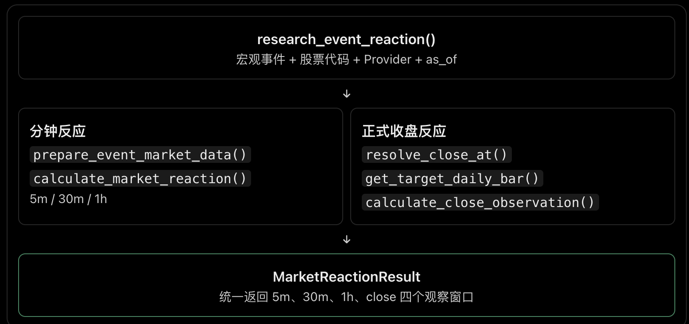

# Day28：Market Reaction 纯计算引擎

## 调用流程



`research_event_reaction()` 是 Day28 的正式入口，接收宏观发布事件、股票代码、行情 Provider 和 `as_of`，统一返回 `MarketReactionResult`。内部流程分为：

- 分钟反应：复用 Day27 的时间对齐结果，计算 T+5m、T+30m 和 T+1h；
- 正式收盘反应：使用 XNYS 交易日历找到事件后的第一次正式收盘，取得对应交易日的日线；
- 结果合并：在 `observations` 中统一返回 `5m`、`30m`、`1h` 和 `close`。

## 价格与时间口径

事件前参考价格采用事件之前最近一根完整 1m K 线的收盘价。这根 K 线结束时间不能晚于事件时间，并且与事件时间的距离不能超过 5 分钟。

T+5m、T+30m 和 T+1h 均为从已确认实际发布时间开始计算的墙上时间，不是累计交易分钟：

- `target_at = event_at + offset`；
- 选择结束时间不晚于 `target_at` 的最近一根完整事件后 K 线；
- K 线结束时间与目标时间的差距必须小于 60 秒；
- `price_at` 保留实际使用的 K 线结束时间，不能把近似价格伪装成精确目标时点价格。

收益率统一使用：

```text
(观察价格 / 事件前参考价格 - 1) × 100
```

## 交易时段规则

分钟观察窗口不因交易时段切换而重置。只要 Provider 返回对应时段的完整分钟 K 线，观察点可以从盘前跨入正常交易时段，也可以使用盘后行情。

例如事件发生在盘前，T+30m 落入正常交易时段时，使用目标时间之前最近的正常盘完整 K 线。如果目标时间已经到达但附近没有符合误差要求的 K 线，则该观察点标记为 `missing`，不会向更早的远距离价格回退。

正式收盘采用 XNYS 交易日历：

- 盘前或正常交易时段发生的事件，使用当天正式收盘；
- 当天收盘后、周末或休市日发生的事件，使用下一个交易日正式收盘；
- 日线必须属于目标交易日，其结束时间必须等于交易所正式收盘时间；
- 日线与事件前分钟参考价必须使用相同复权口径。当前 Market Reaction 请求原始价格 `raw`。

## 观察状态

- `usable`：目标价格和收益率可以计算；
- `pending`：目标时间或正式收盘尚未到达，或对应行情尚未在 `as_of` 前可用；
- `missing`：目标时间已经到达，但对应行情不存在或时间无法确认；
- `unavailable`：参考价格缺失或价格复权口径不一致，不能计算该观察点。

分钟行情能力缺失时，Day26/Day27 Provider 仍抛出 `MarketDataCapabilityError`；Day28 服务边界将其转换为 `MarketReactionResult`，并记录 `minute_data_capability_unavailable`，不把能力缺失伪装成正常空行情。

## 验收

专项测试：

```bash
cd backend
.venv/bin/pytest -q -p no:cacheprovider \
  tests/test_market_reaction.py \
  tests/test_market_reaction_alignment.py \
  tests/test_longbridge_market.py
```

测试覆盖：

- T+5m、T+30m、T+1h 与正式收盘收益率；
- 盘前跨正常交易时段的墙上时间窗口；
- `pending`、`missing` 和 `unavailable`；
- 收盘后的事件使用下一交易日正式收盘；
- raw/forward-adjusted 口径及不支持的 split-adjusted；
- 分钟行情能力异常的结构化转换。

离线验收：

```bash
PYTHONPATH=backend/src backend/.venv/bin/python \
  evals/verify_day28_market_reaction_offline.py
```

离线脚本使用 CPI fixture、NVDA 原始分钟行情和原始日线，验证参考价 100、T+5m 5%、T+30m 10%、T+1h 20% 和正式收盘 30%。

## 已知限制

- 分钟 OHLC 不能还原事件发布瞬间的逐笔成交；
- 目标股票与 QQQ、行业 ETF 的基准比较属于 Day29；
- 历史同类事件查询属于 Day29；
- 真实宏观事件与真实行情的端到端联调属于 Day30。
