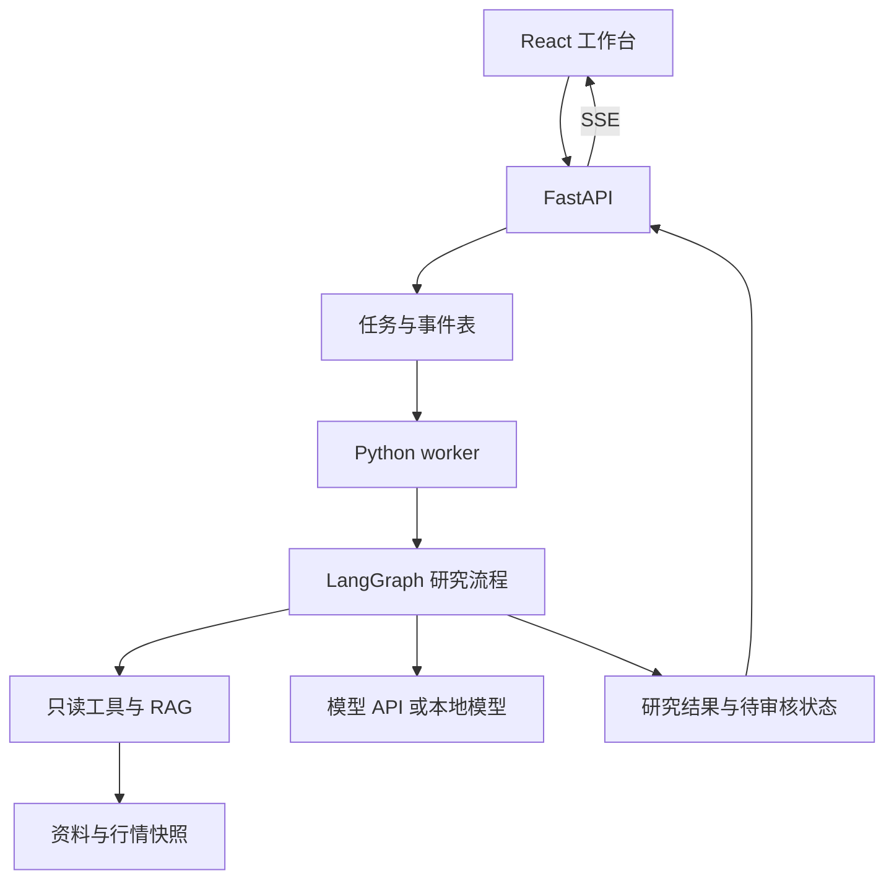

# 股票 Agent 开发计划 · Python 后端版

版本：v2.0，2026-09-07。  
技术方向：React + TypeScript 前端；Python + FastAPI 后端；LangChain / LangGraph Python；PostgreSQL + pgvector。  
排期假设：有基本 Web 开发经验，能阅读 React / TypeScript，会基本 Python，但没有完整开发过 Agent；若这些基础尚不具备，需要另加学习时间。  
安排：面试展示主线 6 周 / 30 个开发日 / 约 120 小时；自用扩展另列 4 周 / 20 个开发日。每天按 4 小时、每周 5 天估算。

本版基于原开发计划重写为 Python 架构，并按最近讨论，把面试展示作为第一交付目标。它是一份独立的对照版本。文中的路径、接口和代码是拟开发设计，尚未构成已经实现或接入券商的项目。

## 1. 这次具体改了什么

| 原计划 | 本版 |
| --- | --- |
| Node.js + Fastify 业务后端 | Python + FastAPI |
| Zod 后端校验 | Pydantic；React 侧保留 TypeScript 类型与必要运行时校验 |
| LangChain JS | LangChain Python |
| LangGraph JS | LangGraph Python |
| TypeScript 策略与回放 | Python 纯函数策略与回放 |
| Node.js worker | 独立 Python worker |
| IBKR 单独增加 Python 语言适配层 | 直接在 Python 工程实现适配；需要进程隔离时仍可单独运行 |
| TypeScript 共享前后端领域类型 | 后端 Pydantic / OpenAPI 定义契约，前端生成或同步 TypeScript 类型 |
| 10 周交易工程主线 | 前 6 周交付研究与本地模拟演示；后 4 周延伸到券商模拟与自用验证 |

React 前端仍然使用 TypeScript。Vite 等前端开发、构建工具与业务后端分开讨论；本方案不需要常驻 Node.js 业务服务，也不增加一层仅做转发的 Node.js BFF。

### 1.1 面试版的产品定义

项目名称可用“股票研究与模拟交易 Agent”。它应能展示：

1. 输入公司或股票及研究问题。
2. Python Agent 调用明确的只读工具，获取资料或行情快照。
3. 从有限资料集中检索证据，并生成可追溯分析。
4. React 页面显示任务阶段、流式内容、引用和错误状态。
5. 任务可以暂停审核、取消、刷新后查看和服务重启后恢复。
6. 一套固定规则在本地模拟器中生成计划、进行风控并执行模拟订单。
7. 固定案例、检索对比和故障演示能证明实现质量。

不以盈利作为面试版验收标准。真实、历史和虚构数据在界面明确标识，演示结果不冒充实盘结果。

### 1.2 工期的含义

6 周是范围受控、使用小资料集、可以借助编码助手完成常规代码的估算。你仍需自己理解与验证核心实现。如果 Python 异步、数据库和部署都比较陌生，可加 1–2 周缓冲。

后续 4 周是自用工程扩展工作量，不包含足够长的真实市场观察保证。券商权限和长期前向模拟不能按开发天数强行完成。

## 2. 固定技术栈与运行方式

| 层 | 选择 | 本项目职责 |
| --- | --- | --- |
| 前端 | React + TypeScript + Vite | 任务工作台、引用、审核、模拟结果 |
| API | FastAPI | 身份校验、请求验证、任务入口、查询和 SSE |
| 服务运行 | ASGI 服务器，如 Uvicorn | 运行 FastAPI 应用 |
| 数据校验 | Pydantic v2 风格模型 | 工具参数、请求、研究输出和业务对象校验 |
| HTTP | HTTPX AsyncClient 或供应商异步 SDK | 请求模型、新闻和行情接口 |
| Agent | LangChain Python | 模型、工具和受控调用循环 |
| 工作流 | LangGraph Python | 研究节点、条件分支、审核与 checkpoint |
| 数据库 | PostgreSQL + SQLAlchemy 异步访问 + 迁移管理 | 任务、事件、证据、计划和模拟账本 |
| 检索 | 关键词基线 + pgvector | 小型资料集的语义及混合检索 |
| 后台任务 | Python worker + 数据库任务表 | 与网页连接分离的研究、导入、回放任务 |
| 验证 | pytest 与固定评估脚本 | 规则/状态测试、模型案例和指标 |
| 部署 | Docker Compose | API、worker、PostgreSQL 和静态前端 |

LangChain / LangGraph 有 Python 实现，FastAPI 提供 SSE，Pydantic 提供运行时数据验证。[P1][P2][P3][P4] 具体小版本、供应商 SDK 和数据库驱动在开工时核对兼容性并锁定。

### 2.1 API、worker 与静态前端

前端提供页面，FastAPI 接收请求，worker 领取任务并执行 Agent。任务状态、事件和结果写入 PostgreSQL，API 从中读取并向前端推送。



图中的模型可以是云端 API，也可以是已部署好的本地服务。Python 后端调用模型，不意味着需要用 Python 自己训练或托管大模型。

第一版只选择一个生成模型与一个 Embedding 配置。它们可来自不同服务，但模型质量、工具支持、维度和费用都要记录。

### 2.2 后台任务不会因为换 Python 自动可靠

`asyncio.create_task()` 是进程内调度；FastAPI 的 `BackgroundTasks` 也不等于持久任务队列。进程退出后，靠内存维护的任务不能自动恢复。[P5][P6]

最终面试版本使用数据库任务记录与独立 worker。早期教学脚本可以在一个进程里跑，迁移时要明确哪些状态从内存移到了持久存储。

## 3. Python 部分需要补哪些知识

已有 HTTP、事件循环、异步、事务和状态管理经验可以复用；如果 Python 基础尚不熟悉，先补充函数、类、异常和模块，再学习下面这些差异。

| 知识 | 需要做到 | 练习位置 |
| --- | --- | --- |
| 虚拟环境和依赖 | 独立环境、固定依赖、配置可复现 | D01 |
| 类型标注与 Pydantic | 明确输入输出，并验证不可信数据 | D02 |
| async / await 与协程 | 知道协程如何被执行、等待与调度 | D02 |
| 超时与取消 | 清理资源，正确传播取消；不把超时当外部动作未执行 | D04、D18 |
| HTTPX 连接池 | 复用异步客户端，正确关闭响应与连接 | D04 |
| FastAPI 依赖与生命周期 | 管理数据库和 HTTP 客户端等资源 | D06 |
| SQLAlchemy AsyncSession | 按任务/请求管理 session 与事务边界 | D09 |
| SSE 与异步生成器 | 发送有身份和顺序的事件，处理断开 | D07、D10 |
| worker 与持久任务 | 页面连接、任务执行、任务恢复分别管理 | D09、D17 |
| I/O 与计算任务 | 知道哪些调用会阻塞循环，哪些应移到独立进程 | D04、D24 |

需要留意：调用 Python 的 `async def` 函数通常先得到协程对象，要 await 或调度才会执行；取消时用 finally 清理资源，不吞掉取消信号。[P6]

本项目对长回放、重型解析的设计是移到独立 worker 或计算进程。使用 `async def` 本身不会把同步 CPU 工作变成不阻塞操作。

## 4. 每日节奏与整体里程碑

每天 4 小时建议分配：30 分钟阅读；150 分钟编码；45 分钟验证；15 分钟写笔记与提交。

| 周次 | 本周核心 | 可演示成果 |
| --- | --- | --- |
| 第 1 周 D01–D05 | Python 模型调用、校验与手写工具循环 | 命令行 Agent 与固定案例 |
| 第 2 周 D06–D10 | FastAPI、React SSE、LangChain 与任务持久化 | 网页研究助手 |
| 第 3 周 D11–D15 | 资料导入、RAG、Embedding、检索评估 | 有来源的资料问答 |
| 第 4 周 D16–D20 | LangGraph、恢复、审核、取消和故障 | 可恢复研究流程 |
| 第 5 周 D21–D25 | 行情适配、简单规则、本地模拟与风控 | 可复现模拟演示 |
| 第 6 周 D26–D30 | 评估、性能、部署和面试表达 | 可展示的项目版本 |

## 5. 第 1 周：模型调用和 Python 基础

本周先用一个模型和少量虚构资料，不连接交易接口。所有 fixture 数据必须带有明确标识。

### D01：完成第一次 Python 模型请求

- [ ] 建立 `backend/`、虚拟环境、依赖声明和配置样例；密钥只在服务端环境中配置。
- [ ] 编写 `examples/hello_model.py`，用所选模型的官方 Python SDK 请求一次分析。
- [ ] 输入一段明确虚构的公司公告，打印输出、耗时及可获得的用量。
- [ ] 测试错误密钥/错误模型配置等一种失败路径；日志脱敏。

交付：可以重复运行的小脚本与启动说明。

完成标准：能指出模型实际收到的内容、发请求的代码、输出解析位置，以及失败时在哪里处理。

4 小时细分：30 分钟读例子；45 分钟配置环境；75 分钟接模型；45 分钟验证错误；45 分钟整理说明和笔记。

### D02：补 Pydantic 与 asyncio

- [ ] 写一个 Pydantic 研究请求模型，限制公司 ID、问题长度和数据模式。
- [ ] 编写两个模拟异步 I/O 函数，分别顺序等待和并发执行；观察调用过程。
- [ ] 验证缺字段、额外字段、非法日期和空问题。
- [ ] 明确模型可见的资料范围：没有报价资料，就不能把生成的价格当作行情。

交付：`schemas.py` 和异步调用练习。

完成标准：类型标注、运行时校验和业务规则三者能说清；不会把单纯创建协程当成已经执行。

### D03：亲手实现工具调用

- [ ] 写 `get_quote`、`get_company_profile` 两个只读 Python 工具，先返回带时间和来源的假数据。
- [ ] 定义工具参数 schema 和白名单；未知工具不能执行。
- [ ] 模型返回工具名和参数后，由 Python 校验、执行，并按工具调用 ID 回传结果。
- [ ] 允许模型继续回答或再次查工具，限制最多 3 轮决策、4 次工具执行。

交付：`examples/manual_agent.py` 和完整调用事件记录。

完成标准：知道“模型提出请求”和“你的程序执行函数”是不同步骤；不使用 eval 或执行模型生成的任意代码。

### D04：结构化输出、超时和取消

- [ ] 定义研究输出 schema；启用所选模型支持的结构化输出方式，并做应用层验证。
- [ ] 校验 evidence_id 必须属于本次提供的资料，格式正确也可能因证据错误而失败。
- [ ] 设置工具超时、总耗时、轮数和调用预算；格式修复最多一次。
- [ ] 复用 HTTPX AsyncClient 或供应商异步客户端；清理取消后的资源。[P7]

交付：统一错误模型、业务校验器、超时案例。

完成标准：缺证据时可以返回信息不足；取消后不继续发起新工具调用；已发出的远端请求可能仍有耗时或费用，不能假定已撤回。

### D05：第一周验收

- [ ] 固定 10 个案例：普通分析、两种工具查询、缺资料、矛盾资料、错误参数、未知工具、超时、虚构引用、循环预算耗尽。
- [ ] 保存输入、工具事件、最终结果、版本和人工判定。
- [ ] 用脚本验证可确定的结构与权限规则，人工核对事实支持。
- [ ] 写一段自己的讲解：为什么要限制模型可用工具，而不只在提示词中说“请遵守规则”。

交付：`evals/basic_cases.jsonl`、结果报告、第一周演示。

周门槛：每个案例能进入明确终态；非法工具无法执行；假资料不被标记成实时数据。

## 6. 第 2 周：FastAPI + React 工作台 + LangChain

本周把第一周领域函数复用到正式后端，手写 Agent 留作教学示例，主应用迁移到 LangChain Python。[P1]

| 开发日 | 学习重点 | 实现任务 | 完成标准 |
| --- | --- | --- | --- |
| D06 | FastAPI、Pydantic 请求与生命周期 | 创建研究任务/查询任务接口；约定 run_id、状态和错误；初始化客户端与数据库连接 | 创建任务返回明确身份；输入错误能读懂；不返回密钥和原始敏感错误 |
| D07 | React SSE 与事件归并 | 问题输入、任务卡片、阶段时间线、流式输出；按 run_id 隔离状态 | 切换任务后旧事件不会覆盖新结果；未完成的 JSON 不被当最终对象 |
| D08 | LangChain Python | 用 create_agent / tool 等当前 Python 接口封装原工具；异步路径使用适合的异步调用方式 | 复用 D05 案例，能解释框架接管了哪部分循环；不把 JS 方法名直接照搬 |
| D09 | PostgreSQL、任务表、独立 worker | API 持久化任务后返回；worker 领取、执行和写入语义事件；保存状态与结果 | 关闭页面任务仍能运行；刷新能看到任务；并发数据库任务各管理自己的 session |
| D10 | 事件恢复与取消协议 | 加结果快照、事件序号、重新连接和取消请求；补充一条完整网页演示 | 事件可去重；取消状态与运行状态一致；进程中断暂时标为可恢复，完整恢复在第 4 周实现 |

API、worker、SSE 不共用一个长时间打开的数据库事务。SQLAlchemy 的异步 session 需要按使用单元管理，避免多个并发任务共享可变事务状态。[P8]

### 6.1 前端值得做深的细节

对“已持久化的任务事件”和“暂时的输出 token”采用不同策略。任务开始、工具完成、进入审核、最终结果等是可回放事件；token 可以只用于即时显示，重连后由结果快照重新构建显示。

每个持久事件含 run_id、seq 和 event_type。客户端按序号去重；不能仅靠组件挂载时清空状态解决任务串线。

页面断开默认停止订阅，不自动取消后台研究。用户主动点击取消才发出明确取消请求。FastAPI 支持 SSE，但事件身份、重连和业务取消语义由应用设计。[P3]

周交付：React + Python 研究工作台、事件契约和 10 个固定案例。

## 7. 第 3 周：RAG 与检索评估

资料范围控制在 1–2 家公司、约 10–20 份公告/财报。先人工导入公开且可使用的资料，避免第一版被爬虫、OCR 和大量数据治理拖住。

| 开发日 | 学习重点 | 实现任务 | 完成标准 |
| --- | --- | --- | --- |
| D11 | 原文、chunk、元数据 | 导入资料，记录来源、公司、报告期、发布时间、首次获得时间和内容 hash；保留表头及单位 | 每个 chunk 能回到原资料与版本；重复导入不重复生成文档 |
| D12 | 两步 RAG 与关键词基线 | 先按公司和时间过滤，再检索；把片段交给模型；输出证据 ID、事实、推断和缺失信息 | 资料不足时承认不足；不同公司和未来报告不会混入 |
| D13 | Embedding 与 pgvector | 用一个嵌入配置建立向量；查询使用兼容配置；保留关键词对照 | 中文问题查英文资料有实际样本验证；向量维度和模型版本可追踪 |
| D14 | 混合检索与引用检查 | 对两条检索结果合并去重；过滤约束同时作用于两条路径；前端可打开证据片段 | 精确术语和证券代码能找到；合法引用 ID 仍要核对是否支持结论 |
| D15 | 固定评估 | 准备 20 个问题，先分 12 个开发题和 8 个保留题；比较检索效果、缺信息处理、延迟和成本 | 有可复算报告；没有改善时可保留关键词方案；不捏造效果提升 |

检索方式与框架解耦。RAG 可以从现有数据库检索，不必先使用向量；pgvector 支持精确相似度查询及结合全文检索。[P9][P10]

评估集包括答案明确、无资料、报告期错误及来源冲突。每个可回答问题标注全部必需证据；比较两季财报时，两季资料都要命中才算完整覆盖。

指标分开记录：检索找到了多少必需证据；引用 ID 是否有效；原文是否支持句子；数字和单位是否正确；无依据时是否停止判断。自动检查不能替代所有事实核对。

本周嵌入计算由独立导入任务完成，不能用户每次问问题都重新嵌入所有文档。小资料集先用精确检索，近似索引及复杂 reranker 作为后续优化。

周交付：有来源的 RAG、固定小评估集和关键词/语义/混合检索对比。

## 8. 第 4 周：LangGraph、审核和任务恢复

本周使用 Python 版 LangGraph；图节点代表研究步骤，图状态保存执行上下文，订单账本不放在图状态里。

| 开发日 | 学习重点 | 实现任务 | 完成标准 |
| --- | --- | --- | --- |
| D16 | State、Node、条件边 | 拆成取快照、检索、检查证据、生成、校验节点；定义 TypedDict 等适合的状态 schema | 每个节点输入输出能解释；证据不足最多补查一次，随后明确结束 |
| D17 | Checkpoint 与任务恢复 | 持久化图状态；将 thread_id 绑定当前用户和 run_id；worker 启动处理未完成任务 | 进程重启后能恢复正确任务；不同用户或任务不能互相恢复 |
| D18 | interrupt、审核版本与取消 | 研究完成后暂停审核；通过/退回绑定结果版本和有效期；处理取消和重复点击 | 旧版本不能被错误确认；取消后进入一致状态；重复审核只产生一个有效结果 |
| D19 | 节点重放与幂等 | 注入节点完成后响应丢失、审核前重启、同一任务重复领取等场景 | 不重复写有效审核结果；任何研究重复调用产生的额外成本都能追踪 |
| D20 | 前端恢复体验与验收 | 网页显示运行、补查、待审核、失败、取消、完成；实现恢复演示 | 刷新后状态正确；能演示资料不足、服务中断和用户退回三个分支 |

LangGraph 中断恢复可能从所在节点开头重新执行，放在 interrupt 前面的副作用可能再次发生。[P11] 因此审核记录、结果保存和任务恢复需要自己的唯一键和版本检查。

### 8.1 三种身份不要混用

- run_id：本应用的一次研究任务。
- thread_id：图持久化定位身份，由服务端与 run_id 关联。
- review_id：对某份具体结果修订的审核记录。

客户端提交审核时，服务端要验证所有权、待审核状态、修订号和取消状态。知道 thread_id 不等于有恢复权限。

### 8.2 一个可演示的恢复案例

研究检索完成后停止 worker，再启动。worker 读取任务和 checkpoint，恢复后续研究；如果正处于待审核，则保持等待。前端重连读取最新快照及后续事件。你应能指出哪些步骤复用已有结果，哪些可能重跑。

数据库任务领取需要事务或等效互斥；记录尝试次数和心跳。本地多实例实验中，同一时刻只允许一个有效执行者持有任务。面试版采用一个 worker，仍应验证重复任务到来时的行为。

周交付：可恢复研究工作流与有版本的审核界面。

## 9. 第 5 周：行情、简单策略和本地模拟

本周使用单个行情适配器或明确标识的历史回放；交易部分只接自己控制的本地模拟器。目标是展示确定性规则和执行边界。

| 开发日 | 学习重点 | 实现任务 | 完成标准 |
| --- | --- | --- | --- |
| D21 | 行情适配与时间 | 定义 QuoteProvider；支持 fixture、historical、live 标记；保存报价事件时间和接收时间 | 过期或延迟数据明确显示；精确价格不从模型文本提取 |
| D22 | 固定策略与纯函数 | 写一套简单入场/退出规范；实现 evaluate(snapshot, position, config)；使用已完成 K 线 | 相同输入结果一致；缺信息不触发；模型不能改策略参数 |
| D23 | Decimal、数量与风险 | 实现单标的额度、风险预算、现有持仓及在途订单约束；持久化计划与预留 | 不用二进制 float 直接计算交易金额；两个并发计划不会共同占用同一额度 |
| D24 | 本地 Broker 与事件回放 | 本地提交、查询、取消、成交事件；加入基本费用与明确成交假设；计算与 API 进程分开 | 请求成功与成交分开；回放不阻塞 API；信号发生之后才可能成交 |
| D25 | 订单未知、部分成交与幂等 | 演示重复信号、部分成交后撤单、接受后丢响应；用稳定业务键恢复 | 不重复开仓；未知状态先核实；已成交部分仍计入持仓 |

策略可以用开盘区间突破作学习基线，提前固定入场、退出、时限和每日次数。无需为了展示模型能力，把本来能精确计算的条件交给模型猜。

AI 初期只解释信号。后续若允许 AI 过滤交易，应作为独立策略变更比较样本外效果，而不是将模型的自评分当成胜率。

### 9.1 面试版模拟器要明确的限制

支持有限的订单状态和成交假设，用于验证程序。它不等于真实市场撮合，也不充分模拟排队、市场冲击和全部公司行动。收益图标明数据、参数和假设。

同一根 K 线同时触及两个退出价时，OHLC 无法确定先后；选择更细数据或预先声明的保守处理。不能为了更高收益事后挑路径。

周交付：研究结果、规则信号、风险判定与本地订单之间的一条可复现链路。

## 10. 第 6 周：评估、部署和面试交付

本周限制新增业务功能，把时间用在证据、可观察性与讲解能力上。

| 开发日 | 学习重点 | 实现任务 | 完成标准 |
| --- | --- | --- | --- |
| D26 | 集成效果评估 | 固定模型/提示/数据/检索版本；跑保留问题；测工具调用、引用、事实与缺资料行为 | 有真实结果与失败案例；修复后不继续把同一保留集当未知测试 |
| D27 | 前端流式与性能 | 缓冲高频 token 更新；检查任务串线、重复事件、滚动体验和长时间线；分别测首事件与最终结果耗时 | 流式展示流畅且状态正确；性能结论附运行条件，不虚构提升比例 |
| D28 | Compose 与运维 | 部署 API、worker、PostgreSQL、静态前端；分离密钥；演示备份恢复和 worker 心跳 | 按 README 能启动；网页关闭不影响任务；恢复后不自动开启交易写权限 |
| D29 | 项目深挖 | 写架构决策、关键时序、评估说明、失败案例、已知限制；录制三段演示 | 能根据代码讲清工具、RAG、SSE、恢复、幂等各自如何实现 |
| D30 | 发布与模拟面试 | 从干净环境启动；演示正常研究、资料不足、任务恢复及模拟单；做一次技术问答 | 交付面试版；每个指标有依据，模拟和真实能力清晰区分 |

建议演示流程控制在 5–8 分钟：先正常研究和引用，再切到缺资料或重启恢复，最后展示一笔模拟订单及一项故障测试。更深的代码与评估报告留给追问。

6 周的发布目标是“可验证的研究与模拟项目”，不是“已证明盈利的自动交易系统”。

## 11. API 与前端契约

### 11.1 推荐接口

以下均为拟开发的内部应用接口。

| 方法与路径 | 用途 | 关键检查 |
| --- | --- | --- |
| `POST /api/runs` | 创建研究任务 | 参数、身份、请求去重、并发与预算 |
| `GET /api/runs/{run_id}` | 获取任务快照和结果 | 所有权、最新状态与修订 |
| `GET /api/runs/{run_id}/events` | SSE 订阅 | 所有权、事件游标、断线恢复 |
| `POST /api/runs/{run_id}/cancel` | 请求取消 | 终态与竞争处理、幂等 |
| `POST /api/reviews/{review_id}` | 通过或退回结果 | 版本、有效期、所有权、重复请求 |
| `POST /api/documents` | 导入资料 | 类型、大小、来源、重复导入 |
| `GET /api/evidence/{evidence_id}` | 查看证据 | 资料权限、版本、上下文 |
| `GET /api/evaluations/{evaluation_id}` | 查看评估结果 | 数据集与版本信息 |
| `POST /api/simulations` | 创建回放/模拟任务 | 模拟模式、策略版本、资金与数据范围 |
| `GET /api/simulations/{simulation_id}` | 读取模拟结果 | 成交假设、来源和运行状态 |

任意 URL 抓取不开放给模型。导入器应使用已允许的来源和服务端检查；外部文本按数据处理，不能覆盖工具权限或系统配置。

### 11.2 Python schema 示例

下面展示命名与分层，是接口草图；真实实现还要加业务验证和数据库映射。

```python
from decimal import Decimal
from typing import Literal
from pydantic import AwareDatetime, BaseModel, ConfigDict, Field


class ResearchRequest(BaseModel):
    model_config = ConfigDict(extra="forbid")
    company_id: str = Field(min_length=1, max_length=80)
    question: str = Field(min_length=1, max_length=2000)
    data_mode: Literal["fixture", "historical", "live"]
    as_of: AwareDatetime


class Claim(BaseModel):
    model_config = ConfigDict(extra="forbid")
    text: str = Field(min_length=1)
    evidence_ids: list[str] = Field(default_factory=list)


class ResearchAnswer(BaseModel):
    model_config = ConfigDict(extra="forbid")
    run_id: str
    status: Literal["ok", "insufficient_data", "failed"]
    as_of: AwareDatetime
    facts: list[Claim] = Field(default_factory=list)
    interpretations: list[Claim] = Field(default_factory=list)
    missing_information: list[str] = Field(default_factory=list)


class QuoteSnapshot(BaseModel):
    model_config = ConfigDict(extra="forbid")
    snapshot_id: str
    instrument_id: str
    price: Decimal = Field(gt=0)
    as_of: AwareDatetime
    received_at: AwareDatetime
    data_mode: Literal["fixture", "historical", "live"]
    source: str
```

Pydantic 负责结构与约束；另外检查公司是否合法、as_of 是否符合任务权限、证据是否存在并支持结论、报价是否过期。空白问题先按业务要求处理，不能只依靠字符串长度。

金额通过 JSON 以十进制字符串传给前端，数据库使用 NUMERIC 等精确类型；前端展示或发回时保持精度。序列化策略在契约层固定，并验证示例请求响应。

### 11.3 SSE 事件草案

```json
{
  "run_id": "demo-run-001",
  "seq": 12,
  "event_type": "tool_completed",
  "occurred_at": "2026-09-07T08:00:00Z",
  "payload": {
    "tool_name": "retrieve_filings",
    "evidence_ids": ["demo-evidence-1"],
    "source_kind": "fixture"
  }
}
```

持久事件使用可恢复游标，客户端根据 run_id 和 seq 去重。重连时先读取任务快照，再接续后面的事件；快照携带已覆盖的序号，避免加载快照期间漏掉或重复应用事件。

临时 token 不一定逐个写数据库。断线后可丢弃不完整文本，用持久化结果或重新订阅后的状态重建显示；不能把不完整文本拼接成一个伪造的完整结论。

前端 TypeScript 类型来自后端 OpenAPI 或受控同步的契约。生成类型可以发现契约变化，但不会自动验证运行时网络数据，也不能代替兼容性测试。

## 12. 目录与数据设计

### 12.1 项目结构

| 路径 | 职责 |
| --- | --- |
| `frontend/src/features/research/` | 任务输入、运行状态和结果 |
| `frontend/src/features/evidence/` | 来源和原文定位 |
| `frontend/src/features/simulation/` | 规则信号、模拟订单和净值 |
| `frontend/src/api/` | API 客户端、契约、SSE 和取消 |
| `backend/pyproject.toml` | Python 项目依赖与工具配置 |
| `backend/src/stock_agent/api/` | FastAPI 路由、依赖、身份校验 |
| `backend/src/stock_agent/schemas/` | Pydantic 请求响应与工具参数 |
| `backend/src/stock_agent/agents/` | LangChain 模型和工具循环 |
| `backend/src/stock_agent/workflows/` | LangGraph 研究图与状态 |
| `backend/src/stock_agent/tools/` | 受控只读工具 |
| `backend/src/stock_agent/knowledge/` | 导入、分段、嵌入、检索与引用 |
| `backend/src/stock_agent/market_data/` | 行情、日历、快照和指标 |
| `backend/src/stock_agent/strategy/` | 固定策略纯函数 |
| `backend/src/stock_agent/risk/` | 数量、额度与预留 |
| `backend/src/stock_agent/oms/` | 订单意图、回报、幂等与对账 |
| `backend/src/stock_agent/brokers/` | 本地模拟与后续券商适配 |
| `backend/src/stock_agent/worker/` | 任务领取、执行、心跳和恢复 |
| `backend/src/stock_agent/storage/` | SQLAlchemy 模型、仓储和迁移 |
| `backend/examples/` | 最小模型调用、手写循环等学习示例 |
| `backend/tests/` | 对关键确定性行为的测试 |
| `evals/` | 模型/RAG 案例、证据标注、结果 |
| `docs/` | 架构决策、演示、评估和运行手册 |
| `infra/` | Compose、环境配置和备份恢复 |

这些目录按开发阶段逐步建立。单一 Python 工程可以有多个启动入口，不意味着每个目录都要成为独立微服务。

### 12.2 数据表

| 阶段 | 表或存储 | 关键关系 |
| --- | --- | --- |
| 第 2 周 | runs、run_events、research_answers、jobs | 请求与执行分离；一个 run 包含多条事件 |
| 第 3 周 | documents、document_revisions、chunks、embeddings | 证据绑定具体文档版本与嵌入配置 |
| 第 4 周 | 图 checkpoint、reviews | 图恢复身份与业务审核身份分开 |
| 第 5 周 | snapshots、strategy_versions、signals、proposals、risk_reservations、order_intents、orders、executions | 数据、计划、受理和成交分别记录 |
| 自用扩展 | account_snapshots、reconciliation_events、outbox、broker_capabilities | 券商实际状态、差异及可恢复执行 |

状态和结果是可查询事实，模型日志只作解释与审计。运行记录保存工具调用、结果引用、错误、耗时和用量，不依赖模型隐藏思维链。

### 12.3 Python 并发边界

HTTP 客户端在合适生命周期内复用；SQLAlchemy session 按并发任务隔离。[P7][P8] 数据库事务内完成状态检查与写入，网络调用在提交之后执行。

共享 HTTP 连接池和共享可变数据库事务不是同一回事。worker 内并发读取独立数据时也要有限流；风险预留和订单动作按账户串行或使用等效事务约束。

## 13. 自用扩展：第 7–10 周

这一部分在面试版本完成后开始。E01–E20 是额外开发日，不计入 D01–D30。先选一个市场、一个券商、一个账户和一种简单订单类型，逐步验证。

本地模拟器只能证明你的软件按设定运行。券商模拟环境进一步验证接口、订单生命周期和对账；仍不能完整复现实盘成交和市场冲击。

### 第 7 周：接入一个券商模拟环境

| 开发日 | 任务 | 交付与验收 |
| --- | --- | --- |
| E01 | 选定市场、券商、模拟账户；核对地区、数据与交易权限 | 能列出支持和不支持的功能、所需账户条件和数据来源 |
| E02 | 定义 Python BrokerAdapter：账户、持仓、报价、提交、查询、撤单 | 本地模拟适配器和券商适配器通过同一组契约案例 |
| E03 | 接入只读账户、持仓和报价；统一时间、币种和标的身份 | 页面展示来源时间、接收时间；数据过期时禁止生成可执行计划 |
| E04 | 在券商模拟环境跑通单笔提交、查询和撤单 | 保存请求身份、券商订单 ID、状态原文与内部状态映射 |
| E05 | 整理券商能力矩阵和失败案例 | 不支持的订单类型在提交前被拒绝；断开连接有明确反馈 |

例如 IBKR 的官方 TWS API 支持 Python，并通过 TWS 或 IB Gateway 连接。[P12] 即使统一为 Python，也可以把需要独立生命周期的券商连接进程隔离。不要把“同一种语言”理解成“只能启动一个进程”。

不同券商模拟账户限制不同。例如长桥官方说明包含模拟交易时段和订单功能限制。[P13] 接入时按选定市场和账户重新核对，不能照搬另一家券商的行为。

### 第 8 周：订单状态、重复请求和对账

| 开发日 | 任务 | 交付与验收 |
| --- | --- | --- |
| E06 | 建立持久订单意图、风险额度预留和 outbox | 同一事务记录意图与待执行动作；进程中断不会丢失待处理动作 |
| E07 | 每个账户限制执行并发；建立稳定业务请求 ID | 重复点击和 worker 重试不会创建两个业务意图；记录券商去重能力边界 |
| E08 | 处理提交超时且结果未知 | 先通过可用的订单查询和对账确认；无法确认时阻止再次提交并提示处理 |
| E09 | 处理部分成交、撤单未确认和剩余数量 | 撤单请求不直接当作已撤；风控使用实际成交和仍在途的数量 |
| E10 | 做重启恢复与差异对账 | 从券商重新获取账户与订单状态；差异未解决前停止新增风险 |

内部唯一键只能控制你自己的系统。跨网络调用不能因为写了幂等键就宣称“绝不会重复成交”。必须核对券商是否接受并保证客户订单标识的去重语义，并保留查询、对账和人工处置入口。

### 第 9 周：策略验证和前向模拟

| 开发日 | 任务 | 交付与验收 |
| --- | --- | --- |
| E11 | 补齐选定市场的日历、复权与公司行动处理，说明费用和成交假设 | 固定数据版本可复算；信号与成交时间无未来数据穿越 |
| E12 | 固定一个策略版本和训练外验证区间 | 保存参数、样本范围、交易明细和基准；不能看到结果后持续修改测试区间 |
| E13 | 比较“固定规则”与“固定规则加 AI 过滤” | 使用相同区间、成本、数据可用时间；分析过滤带来的漏单、延迟和成本 |
| E14 | 处理账户外部变化 | 手工交易或资金变化后重新同步持仓和可用额度；旧计划失效 |
| E15 | 冻结候选版本，启动连续前向模拟 | 每次决策有数据、策略、模型、提示词版本和订单状态记录 |

如果无法取得当时实际可用的新闻或财报版本，E13 就只做前向对比。不要把今天检索到的内容放回过去，声称完成了无偏历史回测。模型训练知识也可能包含回测时点之后的信息，单纯过滤文档日期不能消除这一问题。

### 第 10 周：运行保障和交付

| 开发日 | 任务 | 交付与验收 |
| --- | --- | --- |
| E16 | 加入 worker 心跳、数据过期检查、异常告警和停用开关 | 心跳丢失停止新增动作；停用明确区分禁止新单、撤单、平仓，后三者不得混为一谈 |
| E17 | 分离模型、数据和券商凭据；区分模拟与真实环境 | 界面醒目标记环境，日志不含密钥；部署默认不具备真实下单权限 |
| E18 | 备份恢复演练 | 从备份恢复业务状态后先对账，再允许重新执行 |
| E19 | 运行断网、进程终止、重复事件、部分成交等故障案例 | 每个案例记录预期状态、实际状态与未解决差异 |
| E20 | 整理自用候选版本和运行手册 | 列出已验证能力、尚未支持场景、恢复方法和后续观察计划 |

建议预留至少 20–30 个交易日作为初步前向模拟观察窗口；这是项目排期建议，不是统计充分性或盈利保证。该观察可能超出第 10 周。真实交易接入是另一个明确决策阶段，应以实际市场规则、账户条件及验证结果为依据。

## 14. 面试时重点展示什么

### 14.1 六项可以拿出证据的能力

| 能力 | 现场展示 | 支撑材料 |
| --- | --- | --- |
| 理解 Agent | 工具参数校验、受控调用、停止条件 | 第一周手写示例、工具契约、失败案例 |
| 理解 RAG | 同一问题的关键词与混合检索结果，点击查看引用 | 固定问题集、证据标注、评估报告 |
| 理解工作流 | 证据不足分支、审核后继续、重启恢复 | 状态图、checkpoint、审核版本记录 |
| 前后端协作 | 流式输出、切换任务、重连、取消 | 事件协议、状态处理、前端交互演示 |
| 工程可靠性 | 重复请求、超时、恢复、未知订单状态 | 故障案例及结果，关键状态测试 |
| 技术取舍 | 为什么采用 Python，为什么暂不拆更多服务 | README 中的架构决策与适用边界 |

如果投前端或 AI 前端岗位，现场演示应给流式交互、异步状态和证据展示更多时间；如果投 Python 后端或 Agent 岗位，就更深入解释任务恢复、工具边界、检索评估和数据库事务。技术栈名称本身不等于项目含金量。

### 14.2 建议准备的追问

1. 为什么需要 Agent？哪些步骤其实使用固定工作流就足够？
2. 为什么第一周手写循环，第二周才引入 LangChain？框架替你处理了什么？
3. RAG 和模型训练有什么区别？为何先建立关键词基线？
4. 引用指向真实文档，是否就代表结论正确？如何核对证据支持关系？
5. 工具超时、模型持续调用工具、输出不符合 schema 时怎么结束？
6. `async def` 与后台 worker 有什么区别？为什么 API 重启后任务还能恢复？
7. SSE 断开后如何恢复？切换任务时如何避免旧消息污染新任务？
8. LangGraph checkpoint 与业务数据库分别负责什么？恢复时哪些动作会重新执行？
9. 为什么审批通过后还需要检查数据、计划版本和风控状态？
10. 内部幂等与券商端去重有什么差别？提交超时为什么不能直接重试？
11. 从 TypeScript 后端换成 Python 后，前后端类型如何保持一致？
12. 评估结果如何得出？数据量小、资料有限和模拟成交分别有哪些局限？

每道题准备“问题—设计选择—具体案例—限制”四个部分。不要背没有实现的架构描述；没有完成的能力应写在后续计划中。

### 14.3 评估报告必须有的内容

- **样本清单**：问题 ID、所属公司、资料截止时间、期望证据或预期失败类型。
- **检索质量**：固定 k 的 Recall@k；需要人工标注相关证据，不能只让模型给自己打分。
- **引用质量**：引用可访问率与抽查的结论支持率分开计算，附错误样例。
- **行为质量**：工具选择是否合理、参数是否合法、缺资料时是否明确说明、是否遵守调用预算。
- **运行质量**：任务成功率、耗时分布、模型调用次数和用量；样本少时列出原始值，谨慎解释分位数。
- **实验条件**：代码、资料、模型、提示词和嵌入配置版本；开发集与保留集分开。

允许结果不理想，例如混合检索在小数据集上没有优于关键词检索。解释错误类型和下一步改进依据，比填入未经测量的提升百分比更有说服力。

## 15. 开发顺序、费用与常见卡点

### 15.1 模型和策略分别由谁负责

你编写行情计算、策略规则、订单约束和风控。模型服务负责阅读检索到的材料、提出工具调用请求并生成分析文字；Python 应用负责验证请求、执行获准工具和检查结果。LangChain 与 LangGraph 是组织程序的框架，不是提供分析能力的模型。

可以接入按调用计费的云端模型，也可以运行本地模型。整个项目不强制依赖某个付费模型。若选择本地运行，需要自己承担硬件、部署与速度限制，并验证模型的工具调用、中文分析和结构化输出能力。即使采用免费模型权重，行情、服务器和运行资源也可能产生费用。

第一周先配置一个可用的模型入口；记录每个 run 的供应商、模型标识、输入输出用量、耗时和错误。设置单次研究调用预算与每日预算。价格和账户额度在实际接入时查询供应商页面，不在本计划中固定假定。

模型暂时不可用时，可用明确标为 fixture 的结果测试页面和任务机制。但模型能力验收必须使用真实模型调用，不能用预设回答冒充。

### 15.2 最常见的实现误区

| 卡点 | 正确处理 |
| --- | --- |
| 把同步 SDK 放入 async 函数，就当它异步了 | 优先使用异步 SDK；确需同步调用时隔离执行并评估取消与线程安全 |
| 在 API 进程中运行长时间 CPU 回测 | 交给独立 worker / 进程；限制任务大小与并发 |
| 用户关闭页面后任务消失 | 任务身份与生命周期存入数据库；SSE 只负责订阅 |
| 取消 asyncio 等同于撤销外部动作 | 分开处理本地取消、外部请求状态和订单撤销；已经发生的动作通过查询确认 |
| 每个请求都重新创建大量网络连接 | 在适当生命周期复用客户端并显式关闭 |
| 多个并发任务共享同一个数据库 session | 分别创建 session，缩短事务；涉及同一账户写入时执行并发控制 |
| Pydantic 校验成功就说明业务正确 | 继续检查权限、时间、证据支持、计划版本、资金与持仓 |
| 向量相似度高就当成可靠证据 | 核对公司、时间、文档版本和结论支持关系 |
| 历史资料任意更新后仍复用旧评估结果 | 记录版本、重新评估；不能静默替换证据 |
| 审核按钮可重复点击且直接执行 | 审核绑定 run、审核记录和计划版本；幂等处理并检查当前状态 |
| 给模型一个任意 Python 执行工具 | 初版只提供参数明确的白名单函数，不执行模型生成的任意代码 |

### 15.3 时间不足时怎样缩范围

先减少公司数量、资料规模、订单类型和页面装饰；必要时将第 5 周模拟交易整体移入扩展版。保留一条完整路径：研究问题 → 工具 → 证据 → 分析 → React 展示 → 失败反馈 → 固定案例验证。

同一个研究工作流能够解释清楚、恢复可靠，通常已经足以展开 Agent 面试。多 Agent、复杂消息队列、实时新闻全量入库和多券商不属于首版必需项。

如果每天只有 1–2 小时，按实际可用时间延长排期，不把 4 小时的开发日机械压缩。进度以可运行交付物为准。

### 15.4 用编码助手时的任务模板

一次只让编码助手实现一个可以验证的小单元。示例：

> 实现本计划 D02 的请求数据模型和异步调用示例。使用当前工程已锁定的 Python 与 Pydantic 版本。先说明哪些字段会被拒绝，再给出实现和运行方法。覆盖正常输入、无时区时间和未知字段三个案例。暂不加入数据库或 Web 框架。解释协程什么时候执行，以及超时时如何清理资源。

后续把 D02 替换为当天任务。要求助手报告实际运行过的检查和未验证项；你自己至少能解释数据流、失败路径以及一处关键设计取舍。

## 16. 查阅资料

下面是本版技术选择对应的官方资料。文档路径及接口会变化，实际开发时以锁定版本为准。课程和博客可以辅助理解，但不要混用不同版本的框架示例。

| 标识 | 官方资料 | 主要对应阶段 |
| --- | --- | --- |
| P1 | [LangChain Python Quickstart](https://docs.langchain.com/oss/python/langchain/quickstart) | 第 2 周：模型、工具和 Agent |
| P2 | [LangGraph Python Overview](https://docs.langchain.com/oss/python/langgraph/overview) | 第 4 周：状态和工作流 |
| P3 | [FastAPI Server-Sent Events](https://fastapi.tiangolo.com/tutorial/server-sent-events/) | 第 2 周：流式接口 |
| P4 | [Pydantic Models](https://pydantic.dev/docs/validation/latest/concepts/models/) | 第 1–2 周：模型与验证 |
| P5 | [FastAPI Background Tasks](https://fastapi.tiangolo.com/tutorial/background-tasks/) | 第 2 周：理解进程内后台任务边界 |
| P6 | [Python asyncio Tasks](https://docs.python.org/3/library/asyncio-task.html) | 第 1–2 周：协程、任务和取消 |
| P7 | [HTTPX Async Support](https://www.python-httpx.org/async/) | 第 1–2 周：异步请求与连接复用 |
| P8 | [SQLAlchemy Asyncio](https://docs.sqlalchemy.org/en/20/orm/extensions/asyncio.html) | 第 2 周起：异步数据库与 session |
| P9 | [LangChain Retrieval](https://docs.langchain.com/oss/python/deepagents/retrieval) | 第 3 周：检索与 RAG 概念 |
| P10 | [pgvector 官方仓库](https://github.com/pgvector/pgvector) | 第 3 周：向量检索及过滤 |
| P11 | [LangGraph Interrupts](https://docs.langchain.com/oss/python/langgraph/interrupts) | 第 4 周：中断和恢复语义 |
| P12 | [IBKR TWS API Introduction](https://www.interactivebrokers.com/docs/tws-api/doc/introduction) | 自用扩展：Python 券商连接 |
| P13 | [长桥交易接口常见问题](https://open.longbridge.com/docs/qa/trade) | 自用扩展：模拟环境能力核对 |

P9 用于阅读检索概念，不代表本项目还需要额外引入 Deep Agents 框架。首版框架范围仍是 LangChain 与 LangGraph。

## 17. 最终交付清单

### 6 周面试版

- [ ] React 工作台与 Python API、worker 能按 README 启动。
- [ ] 模型调用和工具调用有预算、超时、参数校验与错误显示。
- [ ] 每个结论可以区分资料事实、模型解释与缺失信息。
- [ ] RAG 有小型资料集、固定问题集、检索基线和可查看引用。
- [ ] 研究任务具有稳定身份，支持刷新、重连、取消和已实现范围内的重启恢复。
- [ ] 人工审核绑定正确任务及版本，重复提交不会重复产生业务动作。
- [ ] 本地模拟交易明确标记，规则、风控和模拟账本可复算。
- [ ] 仓库包含架构说明、启动步骤、数据说明、评估报告、故障记录和演示脚本。
- [ ] README 清楚说明已完成、未完成与模拟能力边界。

### 后续自用候选版

- [ ] 一个券商模拟账户通过能力核对和适配器验证。
- [ ] 订单提交未知、部分成交、撤单未确认和重复请求均有明确处理。
- [ ] 恢复前进行账户与订单对账，差异有记录且阻止不安全的新增动作。
- [ ] 策略与数据版本冻结，前向模拟可追溯且持续观察。
- [ ] 数据过期、后台失联、备份恢复和人工停用均实际演练。
- [ ] 任何真实交易扩展都单独评估，不由面试演示通过自动推导。

开工时只执行 D01：让一个 Python 脚本调用模型并打印结果、用量或明确错误。完成后再进入 D02，不需要第一天建完全部目录和基础设施。
